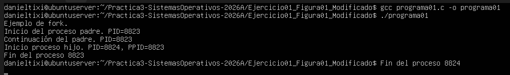

# Modificacion de la figura 01

## Valores PID: 
Es un numero unico que se le asigna a un proceso en ejecucion.  

## Valores PPID: 
Es el numero unico del proceso padre quien creo el proceso actual en ejecucion.

En el siguiente programa podremos ver que un proceso padre tiene PID: 8823  
Mientras el proceso hijo registra un PID: 8824, se observa que al iniciar el proceso hijo el PPID es 8823 ya que ese es el identificador unico del proceso padre.

{fig-align="center" width="1500x"}

