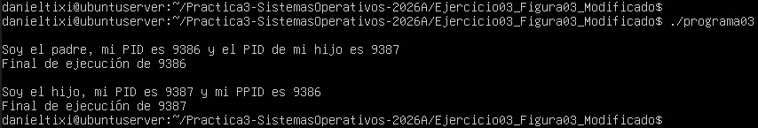
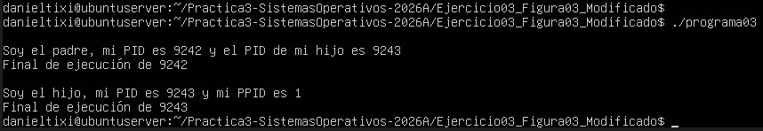
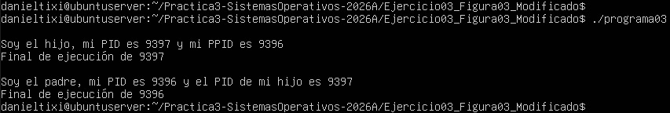
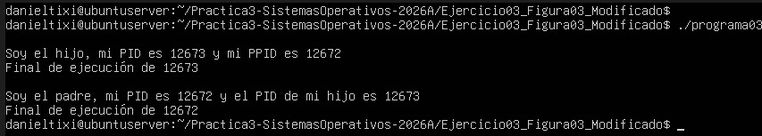

# Modificación de un programa que no maneja espera para procesos hijos

El programa inicia como un único proceso que, al ejecutar la función fork(), se clona para dar vida a un proceso hijo independiente. Ambos comparten el mismo código, pero se distinguen porque el hijo recibe un valor de retorno de cero, mientras que el padre recibe el PID de su nuevo descendiente. Al no haber una funcion que los sincronice ambos buscan acceder a los recursos del sistema operativo para imprimir sus datos y finalizar.  
Al ejecutarse de manera simultánea e independiente, pueden ocurrir tres casos:  

### **Caso 1: Prioridad de ejecución para el proceso padre**  

Este escenario ocurre cuando el sistema operativo otorga prioridad de procesamiento al padre inmediatamente después de la clonación. El proceso padre con PID:9386 completa su flujo y finaliza antes de que el hijo PID:9387 logre utilizar la consola. Se confirma así que ambos procesos operan de forma independiente, compitiendo por los recursos del sistema hasta terminar su proceso. 

* Ejecucion del programa caso 1:  
{fig-align="center" width="1500x"}  

### **Caso 2: Generación de un proceso huérfano**  

Este escenario se presenta cuando el proceso padre con PID:9242 finaliza su ejecución y abandona el sistema antes de que el hijo con PID:9243 imprima sus datos. Debido a que el padre abandona el sistema, el sistema operativo interviene para que el hijo sea adoptado por el proceso inicial del sistema, lo cual se puede observar cuando en la ejecucion del programa se muestra un PPID de 1.

* Ejecucion del programa caso 2:  
{fig-align="center" width="1500x"}  

### **Caso 3: Prioridad de ejecución para el proceso hijo**  

En este caso, el planificador del sistema operativo asigna los recursos de procesamiento al proceso hijo con PID:9397 inmediatamente después de su creación. Debido a esto, el hijo logra imprimir su mensaje y finalizar su proceso antes de que el padre con PID:9396 comience sus propio proceso para ejecutar su mensaje. En la salida del programa se puede observar que el hijo mantiene la relacion con el proceso padre a pesar de haberse ejecutado primero el proceso hijo.  

* Ejecucion del programa caso 3:  
{fig-align="center" width="1500x"}  

### a) ¿Cuál es el PID del proceso padre del proceso hijo creado?
En el caso 1 el PID del proceso padre es 9386

### b) Verifique a qué proceso corresponde el ID encontrado.  
El ID encontrado corresponde al comando **./programa03** que es la intruccion para que se comience a ejecutar el programa.

### c) ¿Cómo se denomina al tipo de proceso hijo?  
Para el caso 2 el tipo de proceso hijo se denomina huérfano ya que su proceso padre sale del sistema porque acaba su ejecucion antes de que el proceso hijo pueda terminar su ejecucion, esto causa que el kernel de linux le asigne por defecto al proceso con PID:1.

# Incluir la funcion wait(NULL)  

Se integró la función wait(NULL) dentro del bloque default de la estructura de control switch, ya que este segmento dx encargado de gestionar las operaciones del proceso padre. Esto para establecer un mecanismo de sincronización obligatoria entre los procesos generados por la llamada fork().  

Se colocó la función antes de que el padre imprima sus mensajes para asegurar que el hijo siempre se ejecute y mande su mensaje a la pantalla en un inicio. Esta mejora elimina el desorden en los resultados y evita que el hijo se quede solo en el sistema, garantizando que siempre reconozca a su proceso padre y no sea adoptado por el proceso raíz del sistema operativo.  

## **Ejecución del programa modificado:**  
{fig-align="center" width="1500x"}  

